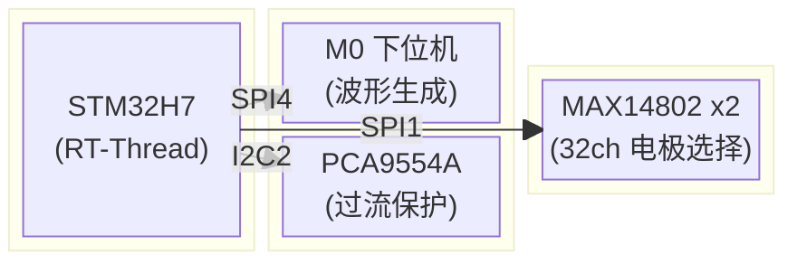
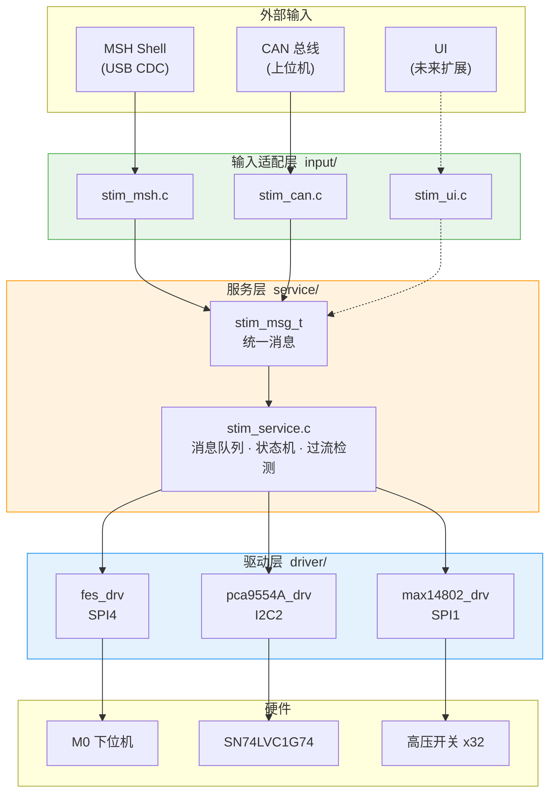
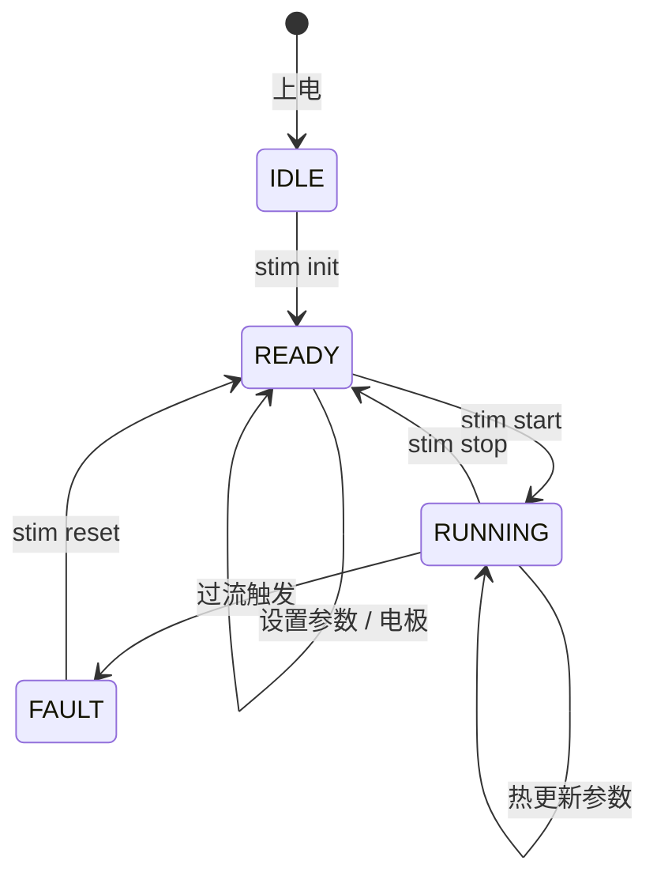
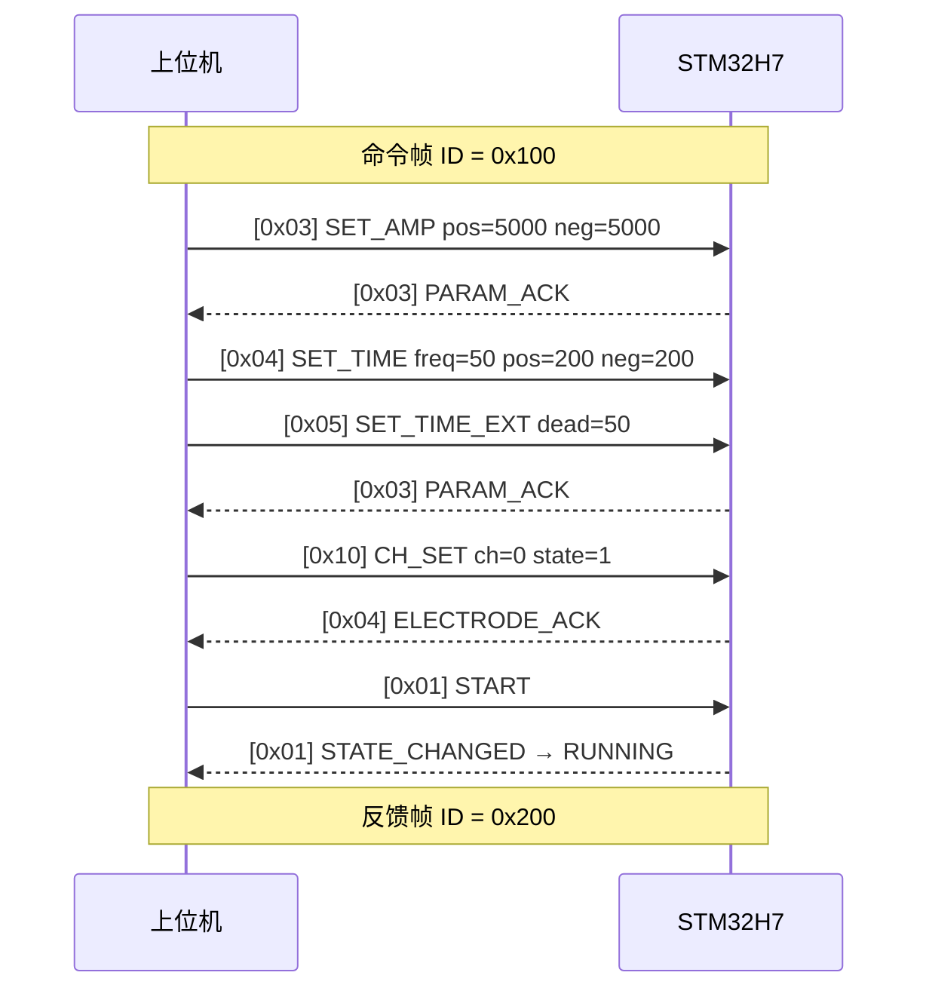

# FFES — 功能性电刺激控制系统


基于 **STM32H7 + RT-Thread** 的多通道可编程功能性电刺激 (FES) 控制系统。

---
## 目录

- [系统概览](#系统概览)
- [硬件架构](#硬件架构)
- [软件架构](#软件架构)
- [目录结构](#目录结构)
- [快速开始](#快速开始)
- [通信协议](#通信协议)
- [扩展指南](#扩展指南)
---

## 系统概览

本项目实现了一套完整的 **多通道功能性电刺激** 系统，由三块 PCB 协同工作，支持 MSH Shell、CAN 总线等多种控制方式，并预留 UI 控制等扩展接口。

### 核心特性
| 实时调度    | **RT-Thread** 操作系统，消息队列驱动的命令调度 |
| 多通道复用 | **32 通道电极选择**，MAX14802 菊花链级联 |
| 硬件安全    | **过流保护**，SN74LVC1G74 + PCA9554A 联动检测 |
| 多源输入    | MSH / CAN / UI (扩展中)，统一消息接口 |
| 热更新        | 运行中可 **实时调整** 幅值和时间参数 |

---
## 硬件架构

### 板卡组成



| 模块 | 通信总线 | 职责 |

| **主控板** STM32H7 | — | RT-Thread 调度、参数管理、多源输入处理 |

| **电刺激** M0 下位机 | SPI4 | 电刺激双相脉冲波形生成 |

| **保护模组** PCA9554A | I2C2 | SN74LVC1G74 控制 + 过流检测 |

| **复用模组** MAX14802 ×2 | SPI1 菊花链 | 32 通道高压模拟开关，电极选择 |

### 总线引脚分配

| 总线 | 设备名 | 关键引脚 | 用途 |

| SPI4 | `fes_stim` | CS = `PE11` | 主控 → M0 (20 字节控制包) |

| SPI1 | `max_stim` | CS = `PA4` | 主控 → MAX14802 (4 字节状态) |

| I2C2 | `pca_stim` | Addr = `0x3F` | 主控 → PCA9554A IO 扩展器 |

| CAN1 | `can1` | — | 外部上位机 ↔ 主控 |

| USB  | `vcom` | — | MSH Shell 终端 (CDC) |

### SN74LVC1G74 通道控制逻辑

| PRE# | CLR# | Q 输出 | 系统状态 |

| `0` | `1` | H | 通道关闭 (安全态) |

| `1` | `0` | H | 初始化打开 |

| `1` | `1` | D→Q | 检测模式 (过流保护生效) |

---
## 软件架构

### 分层设计


-
### 各层职责

| 层级    | 核心原则            | 说明                                                                                 |

| **输入层** | 不持有驱动句柄 | 解析外部输入 → 构造 `stim_msg_t` → 投入消息队列          |

| **服务层** | 唯一业务持有者 | 从队列消费消息 → 执行业务逻辑 → 驱动硬件 → 回调通知 |

| **驱动层** | 内部线程安全    | 封装 SPI/I2C 通信细节，每个驱动独立互斥锁                     |

### 状态机

  



---
## 目录结构
```

h7_spi/

│

├── main.c                        入口：USB Shell 切换 + 服务初始化

│

├── service/                      服务层 — 核心业务逻辑

│   ├── stim_msg.h                  统一命令消息 stim_msg_t

│   ├── stim_service.h              服务层 API 声明

│   └── stim_service.c              消息队列 + 状态机 + 过流检测

│

├── input/                        输入适配层 — 多源输入

│   ├── stim_msh.c                  MSH Shell 命令解析

│   ├── stim_can.c / .h             CAN 总线适配器

│   └── stim_can_protocol.h         CAN 帧 ID + 命令码定义

│

├── driver/                       驱动层 — 硬件抽象

│   ├── SPI/

│   │   ├── protocol.h              SPI 控制包协议 (20B)

│   │   └── fes_drv.c / .h          FES 驱动 (组包 + CRC16)

│   ├── I2C/

│   │   └── pca9554A_drv.c / .h     PCA9554A IO 扩展器

│   └── MAX/

│       └── max14802_drv.c / .h     MAX14802 高压开关

│

├── stimulateTask.c / .h          [归档] V1 旧版实现

└── stimulateTask_v2.c / .h       [归档] V2 (含 MAX14802)

```
---
## 快速开始
### 编译环境

- **IDE**: RT-Thread Studio 或 Keil MDK

- **芯片包**: STM32H7xx

- **需使能组件**: SPI · I2C · CAN · USB CDC
### MSH 命令速查
```bash

# —— 系统控制 ——

stim init                              # 初始化服务 (驱动+线程)

stim start                             # 开始刺激

stim stop                              # 停止刺激

stim status                            # 查看状态 / 参数 / 电极

stim reset                             # 复位故障

# —— 参数设置 ——

stim amp  <pos_uA> <neg_uA>            # 设置幅值 (单位: uA)

stim time <freq> <pos> <neg> <dead>    # 设置时间参数 (Hz / us)

# —— 电极控制 ——

stim ch      <channel> <0|1>           # 开关单通道 (0~31)

stim chmask  <chip> <hex> <0|1>        # 按掩码批量设置

stim chclear                           # 清除所有电极

stim chshow                            # 显示电极状态
```
### 使用示例

```bash

stim init                    # 1. 初始化

stim amp 5000 5000           # 2. 正/负向各 5mA

stim time 50 200 200 50      # 3. 50Hz, 脉宽 200us, 死区 50us

stim ch 0 1                  # 4. 打开通道 0

stim ch 16 1                 # 5. 打开通道 16 (Chip1 CH0)

stim start                   # 6. 开始刺激

stim status                  # 7. 确认运行状态

stim stop                    # 8. 停止

```
---
## 通信协议
### SPI 控制包 (H7 → M0)
> 固定 **20 字节**，CRC16-Modbus 校验

```

┌──────┬──────┬──────┬─────────────────────────┬──────────┐

│ head │ cmd  │ len  │       payload           │  crc16   │

│ 0xAA │      │      │   (15 bytes, 0-padded)  │ (LE)     │

├──────┼──────┼──────┼─────────────────────────┼──────────┤

│  1B  │  1B  │  1B  │         15B             │    2B    │

└──────┴──────┴──────┴─────────────────────────┴──────────┘

```

| Cmd | 命令 | Payload |

|:---:|------|---------|

| `0x01` | START | — |

| `0x02` | STOP | — |

| `0x03` | UPDATE_AMP | `pos_amp_uA` (2B) + `neg_amp_uA` (2B) |

| `0x04` | UPDATE_TIME | `freq` (2B) + `pos_us` (4B) + `neg_us` (4B) + `dead_us` (4B) |

### CAN 协议 (上位机 ↔ H7)

  



#### 命令帧 (`0x100`, 上位机 → H7)

| 码 | 命令 | `data[1~7]` |

|:--:|------|-------------|

| `0x01` | START | — |

| `0x02` | STOP | — |

| `0x03` | SET_AMP | `[1:2]` pos_uA, `[3:4]` neg_uA |

| `0x04` | SET_TIME | `[1:2]` freq, `[3:4]` pos_us, `[5:6]` neg_us |

| `0x05` | SET_TIME_EXT | `[1:2]` dead_us |

| `0x0F` | RESET_FAULT | — |

| `0x10` | CH_SET | `[1]` channel, `[2]` state |

| `0x11` | CH_MASK | `[1]` chip, `[2:3]` mask, `[4]` state |

| `0x12` | CH_CLEAR | — |

#### 反馈帧 (`0x200`, H7 → 上位机)


| 码 | 事件 | `data[1]` |

|:--:|------|-----------|

| `0x01` | 状态变化 | 新状态值 |

| `0x02` | 故障发生 | `0xFF` |

| `0x03` | 参数已应用 | `0x00` |

| `0x04` | 电极已更新 | `0x00` |


> **注意**：`SET_TIME` 参数超过 CAN 8 字节限制，拆分为 `0x04` + `0x05` 两帧，适配器内部自动缓存组合。

---
## 扩展指南

### 接入新输入源
只需 **3 步**，无需修改服务层和驱动层：
```c

// 1. 创建 input/stim_xxx.c
// 2. 构造统一消息
stim_msg_t msg = {0};
msg.cmd = STIM_CMD_START;
// 3. 投入服务层队列
stim_service_send_cmd(&msg);
```
### 接入状态反馈

```c

// 注册监听回调 (最多 4 个)

static void on_stim_event(stim_event_t evt, void *data) {
    if (evt == STIM_EVT_FAULT)
       my_alarm_trigger();  // 自定义处理
}
stim_service_register_listener(on_stim_event);
```
---
<p align="center">

  <sub>Private Project · All Rights Reserved</sub>

</p>