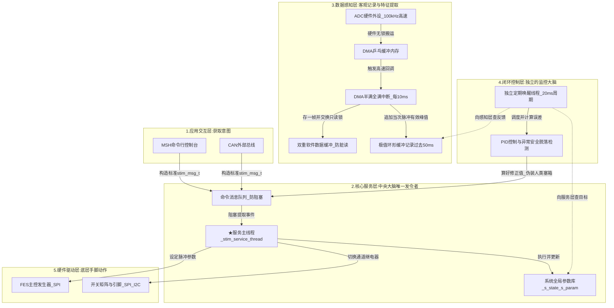
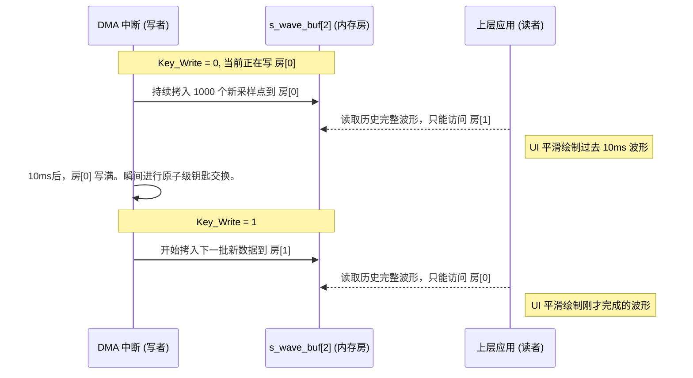
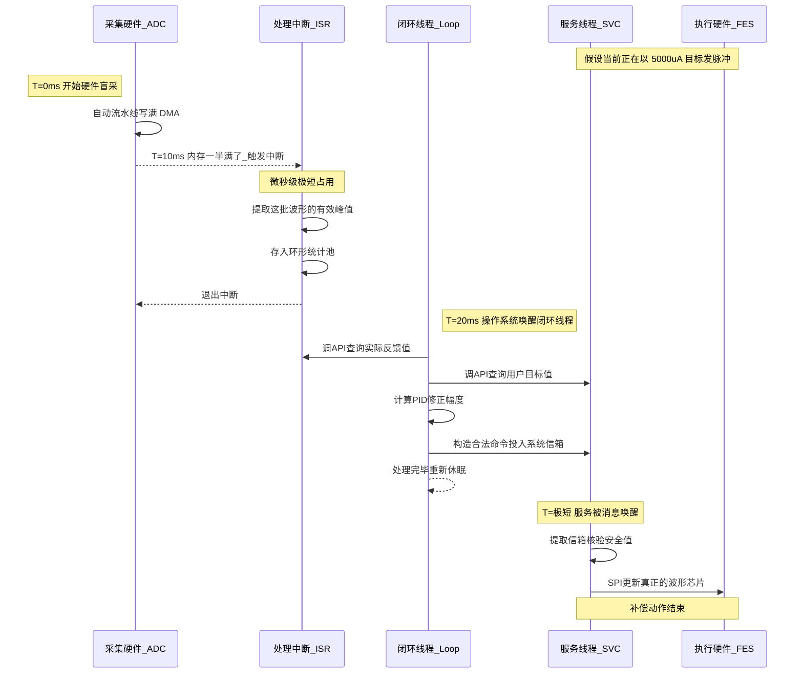

# 多通道功能性电刺激系统 (FES) 核心软件架构与数据链路

  

## 1. 宏观架构：四层解耦模型

  

本系统遵循高内聚、低耦合的设计原则，通过严格的分层，将底层硬件控制、高速数据采集、中央业务调度与上层用户交互解耦。这种设计不仅提升了医疗设备的运行可靠性，也为后续接入各类动态闭环控制算法、FFT 波形特征监控提供了清晰的开发界面。

  

系统的四个主要层次及其数据流转关系如下所示：

  

  

---

  

## 2. 纵横交织的思想：多级缓冲区设计

  

作为混合信号嵌入式系统，既有 $100\text{kHz}$ 的 ADC 极速模拟采样，又有数十毫秒级别的电击物理周期。为了抹平时间尺度的巨大落差，防止数据污染与总线竞争，本系统构建了以下四重缓冲机制。

  

### 2.1 硬件双拼缓冲：DMA Ping-Pong Buffer

**位置：** ADC转换器 $\rightarrow$ SRAM 内存

**原理：** 解决 CPU 不可能在 $100\text{kHz}$ 射速下逐个数取值的难题。

- 申请 `buffer[2000]` 的内存。

- DMA 分为前后两半独立工作。当硬件自动把波形点填满前 1000 个（即前半段 Half-Transfer）时，通知 CPU 可以取走这 10ms 的数据，而 DMA 会毫不停歇地继续向后 1000 个位置写入。

- 这种硬件级别的双缓冲操作彻底解放了主循环算力。

  

### 2.2 防读写污染锁：软件双重缓冲 (Double Buffer)

**位置：** 感知层中断提取 $\rightarrow$ 上层 UI 绘图 / 截图查询

**原理：** 杜绝由于并发访问导致的“脏读”（屏幕显示一半新波形一半老波形）。

  

  

### 2.3 抹平电刺激死区：特征环形滤波缓冲 (Ring Buffer)

**位置：** 感知层 $\rightarrow$ 闭环控制大脑

**原理：** 电刺激波形具有低占空比的特点。如果控制器在随机时刻去采样瞬间峰值，大概率抓到死区内的零值从而发生误判。

- 环形缓冲记录过去 5 帧时长（即 $50\text{ms}$）内的最高有效峰值。

- PID 控制器执行前，调取该环形队列取平均。无论闭环系统在什么相位苏醒，都能获取到一条剥除了电平毛刺和死区空窗期的平滑包络线反馈。

  

---

  

## 3. 中断调度与控制时序

  

在 FES 系统的实时操作系统（RTOS）中，时序的精准调配和优先级的绝对压制是系统稳定的命脉。我们可以通过一幅闭环自动补偿的场景，来一览多级中断如何并肩作战。

  

### 系统响应时序图：一次典型的闭环调节发生

  

  

### 3.1 [最高优先级] 外部过流保护中断 (EXTI)

除了上述控制闭环，系统为安全性部署了独立于 CPU 复杂状态的神级中断：`OC_IN` 过流触发引脚相连的 EXTI 中断。

- 此引脚一旦捕获底层运放的高电平报警，将无视一切软件运行状态立刻触发。

- 在中断的最初几纳秒内，直驱拉低 MAX14802 所有极板引脚或者切断主电源，实现物理断电保护。之后再去用信号量通知 RTOS，宣告系统进入不可逆的死亡状态（`STIM_STATE_FAULT`）。

  

---

  

这种将“重且长”的工作推给独立线程运算（如 Loop与服务主调度），将“快且频”的工作推给 DMA / 中断原子化操作（如采集清洗），将“偶发致命”的工作推给纯硬件与极端高优先级陷入的中断体系，构筑起了 FES 系统高弹性、护城河极深的三级响应时钟流。